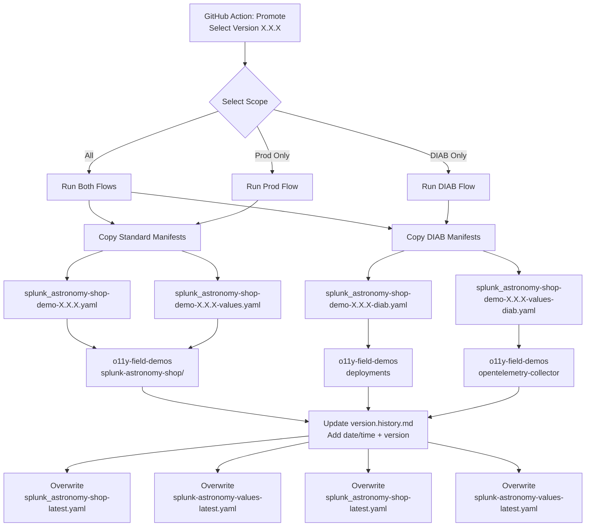

```mermaid
flowchart TD

    A[GitHub Action: Promote<br/>Select Version X.X.X]

    A --> B{Select Scope}

    B -->|All| C[Run Both Flows]
    B -->|Prod Only| D[Run Prod Flow]
    B -->|DIAB Only| E[Run DIAB Flow]

    %% -------------------
    %% PROD FLOW
    %% -------------------
    C --> P1
    D --> P1

    P1[Copy Standard Manifests]

    P1 --> P2[splunk_astronomy-shop-demo-X.X.X.yaml]
    P1 --> P3[splunk_astronomy-shop-demo-X.X.X-values.yaml]

    P2 --> P4[o11y-field-demos<br/>splunk-astronomy-shop/]
    P3 --> P4

    %% -------------------
    %% DIAB FLOW
    %% -------------------
    C --> D1
    E --> D1

    D1[Copy DIAB Manifests]

    D1 --> D2[splunk_astronomy-shop-demo-X.X.X-diab.yaml]
    D1 --> D3[splunk_astronomy-shop-demo-X.X.X-values-diab.yaml]

    D2 --> D4[o11y-field-demos<br/>deployments]
    D3 --> D5[o11y-field-demos<br/>opentelemetry-collector]

    %% -------------------
    %% VERSION HISTORY (moved here)
    %% -------------------
    P4 --> VH[Update version.history.md<br/>Add date/time + version]
    D4 --> VH
    D5 --> VH

    %% -------------------
    %% OVERWRITE LATEST
    %% -------------------
    VH --> P5[Overwrite<br/>splunk_astronomy-shop-latest.yaml]
    VH --> P6[Overwrite<br/>splunk-astronomy-values-latest.yaml]

    VH --> D6[Overwrite<br/>splunk_astronomy-shop-latest.yaml]
    VH --> D7[Overwrite<br/>splunk-astronomy-values-latest.yaml]
```
